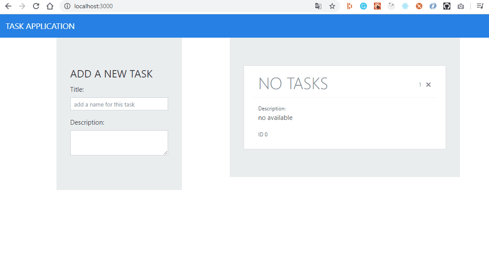
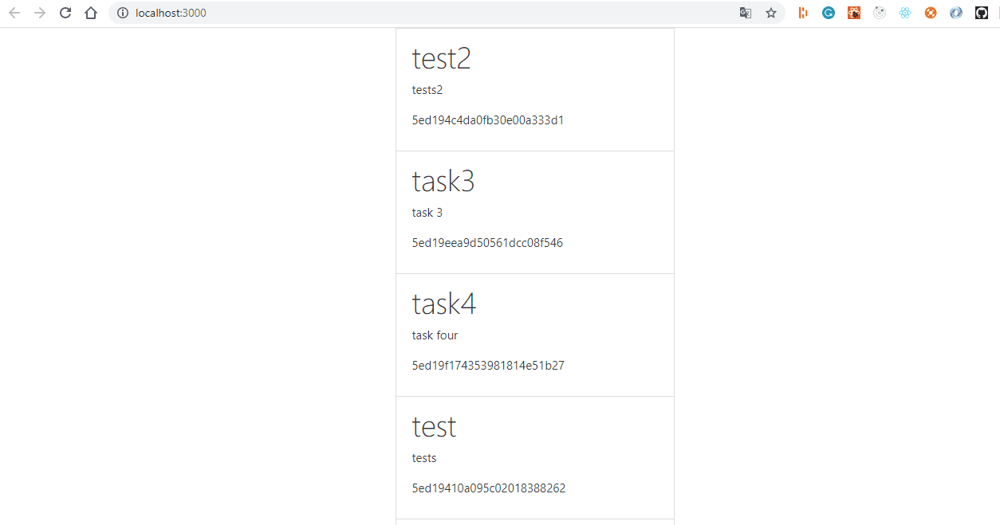

## REACT SORTABLE HOC
_This practice using a backend NODE and frontend REACT -high order components- to order a task list and save the new order in backend._

This project was bootstrapped with [Create React App](https://github.com/facebook/create-react-app).

## ADD TASKS

## SORTABLE LIST

## Available Scripts

In the project directory, you can run:

### `yarn start`

Runs the app in the development mode. 
Open [http://localhost:3000](http://localhost:3000) to view it in the browser.

The page will reload if you make edits. 
You will also see any lint errors in the console.